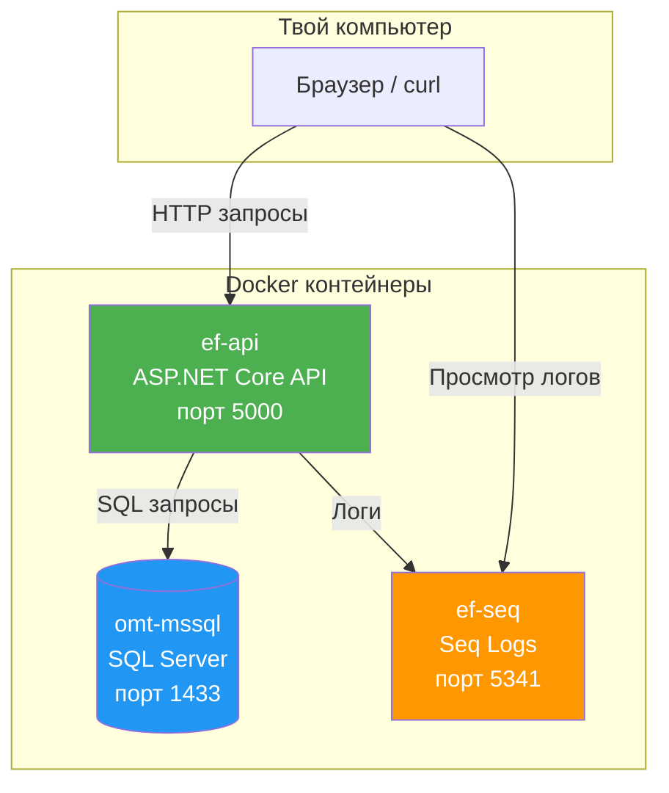
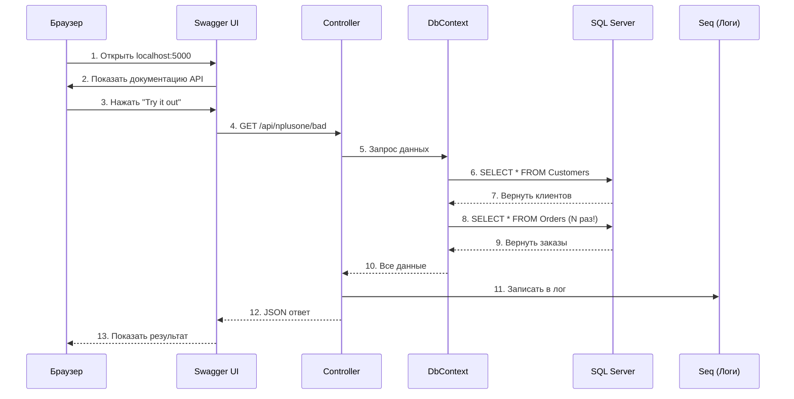

# EF Core Optimizations

Учебный проект для демонстрации техник оптимизации Entity Framework Core.

---

## Диаграммы архитектуры

### 1. Компоненты системы



**Легенда:**
- **ef-api** — наше приложение (принимает HTTP-запросы, отдаёт JSON)
- **omt-mssql** — база данных SQL Server (хранит клиентов, заказы, продукты)
- **ef-seq** — система логирования (показывает все SQL-запросы и ошибки)

---

### 2. Поток выполнения запроса



**Что происходит:**
1. Ты открываешь браузер на `localhost:5000`
2. Swagger показывает список доступных API-методов
3. Ты нажимаешь "Try it out" на каком-то методе
4. Браузер отправляет HTTP-запрос к Controller
5-9. Controller через DbContext делает SQL-запросы к базе
10-13. Результат возвращается обратно в браузер

---

### 3. Структура кода

```
Program.cs                 ← Точка входа (всё начинается здесь)
    │
    ▼
Controllers/               ← Обработчики HTTP-запросов
    ├── NPlusOneController.cs      /api/nplusone/*
    ├── ProjectionController.cs    /api/projection/*
    ├── TrackingController.cs      /api/tracking/*
    ├── IndexController.cs         /api/index/*
    └── DatabaseController.cs      /api/database/*
    │
    ▼
Data/AppDbContext.cs       ← Работа с базой данных
    │
    ▼
Models/                    ← Структура данных (таблицы)
    ├── Customer.cs        Клиенты
    ├── Order.cs           Заказы
    ├── Product.cs         Продукты
    ├── Category.cs        Категории
    ├── Review.cs          Отзывы
    └── Address.cs         Адреса
```

---

### 4. N+1 проблема (Bad vs Good)

```
┌─────────────────────────────────────────────────────────────────┐
│                    BAD: N+1 проблема                             │
│                                                                  │
│  "Дай 100 клиентов с заказами"                                   │
│                                                                  │
│  Запрос 1:   SELECT * FROM Customers LIMIT 100                   │
│  Запрос 2:   SELECT * FROM Orders WHERE CustomerId = 1          │
│  Запрос 3:   SELECT * FROM Orders WHERE CustomerId = 2          │
│  ...                                                             │
│  Запрос 101: SELECT * FROM Orders WHERE CustomerId = 100        │
│                                                                  │
│  Итого: 101 запрос ❌   Время: ~500ms                            │
└─────────────────────────────────────────────────────────────────┘

┌─────────────────────────────────────────────────────────────────┐
│                    GOOD: Оптимизированный                        │
│                                                                  │
│  "Дай 100 клиентов с заказами"                                   │
│                                                                  │
│  Запрос 1:   SELECT c.*, o.*                                     │
│              FROM Customers c                                    │
│              LEFT JOIN Orders o ON c.Id = o.CustomerId           │
│              LIMIT 100                                           │
│                                                                  │
│  Итого: 1 запрос ✅   Время: ~50ms                               │
└─────────────────────────────────────────────────────────────────┘
```

---

### 5. Docker-инфраструктура

```
docker-compose up -d
        │
        ▼
┌───────────────────────────────────────────────────────────┐
│                 efcore-network (сеть)                      │
│                                                           │
│  ┌─────────────┐  ┌─────────────┐  ┌─────────────┐       │
│  │  omt-mssql  │  │   ef-seq    │  │   ef-api    │       │
│  │  SQL Server │  │    Logs     │  │     API     │       │
│  │  :1433      │  │   :5341     │  │   :5000     │       │
│  └─────────────┘  └─────────────┘  └─────────────┘       │
│        │                │                │                │
│        └────────────────┴────────────────┘                │
│              Контейнеры общаются по именам                │
│              (api знает mssql как "mssql")                │
└───────────────────────────────────────────────────────────┘
        │
        ▼
┌───────────────────────────────────────────────────────────┐
│                   Твой компьютер                          │
│                                                           │
│  localhost:5000  →  Swagger UI (API)                      │
│  localhost:5341  →  Seq (логи)                            │
│  localhost:1433  →  SQL Server (база)                     │
└───────────────────────────────────────────────────────────┘
```

**Что запускается:**
- **omt-mssql** — база данных с тестовыми данными
- **ef-seq** — веб-интерфейс для просмотра логов и SQL-запросов
- **ef-api** — наше приложение (ждёт, пока база будет готова)
